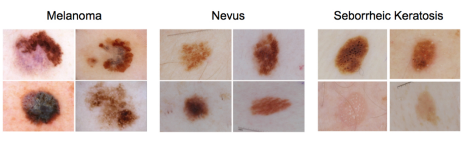

# Dermatologist AI

## Introduction

In this project, we will develop an algorithm that can visually diagnose melanoma, the deadliest form of skin cancer. The algorithm will be trained to distinguish melanoma from two types of benign lesions (nevi and seborrheic keratoses) using images of skin lesions. The project is inspired by the 2017 ISIC Challenge on Skin Lesion Analysis Towards Melanoma Detection, in which participants were asked to design an algorithm to diagnose skin lesion images as one of three different skin diseases (melanoma, nevus, or seborrheic keratosis).


## Getting Started

To get started with this project, you will need to clone the repository and create a `data/` folder to hold the dataset of skin images.

```bash
git clone https://github.com/adnankarim/dermatologist-ai.git
mkdir data; cd data
### Prerequisites

* Python 3.
* Numpy 
* Pandas
* MatPlotLib
* OpenCv
* Pytorch. 

## Project Instruction

### Instructions
1. Clone the repository and navigate to the downloaded folder.

	```	
	git clone https://github.com/adnankarim/dermatolist_ai
	cd cancer_detection
	```
2. Open the cancer_detection.ipynb

	```
	jupyter notebook cancer_detection.ipynb	
	```
3. Read and follow the instructions! This repository doesn't include any dataset you need. You can check out the getting started to download them.

## Project Information

### Contents

- Intro
- Step 0: Import Datasets
- Step 1: Detect type of skin cancer
- Step 2: Create a CNN to Classify Dog Breeds (using Transfer Learning)
- Step 3: Write Your Algorithm
- Step 4: Test Your Algorithm


